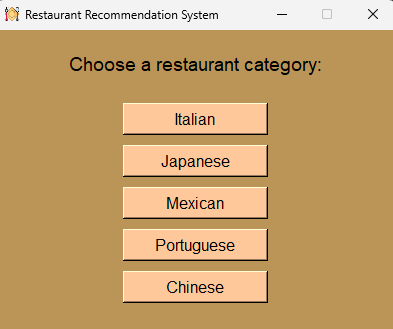
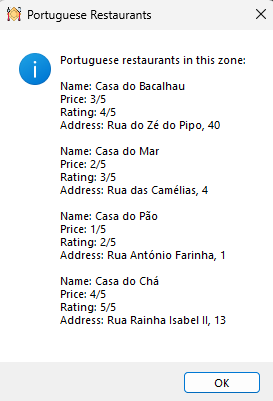
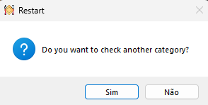

# Restaurant Recommendation System

## Description:

This project is a small application that offers users the ability to find restaurants within a specific geographic area, according to the type of cuisine.

The idea is merely to showcase the possibilities for what could be a larger-scale project, as this project is limited by the amount of data inserted. In this case, it only uses lists of dictionaries instead of a database like SQLite, MySQL, MongoDB, among others.

> [!NOTE]
> This work was performed using Python Programming Language and GUI TKinter

## How to execute the script?

There are two versions of the application—one, `main_code.py` in plain text format with interaction through the console, and another `main_code_gui.py` in GUI (Graphical User Interface) format, with interaction through the graphical interface.

Focusing only on the GUI version, when you run the application, you will encounter the following window:

Here, you can choose the type of cuisine you want.

After selecting a type of cuisine, the corresponding results will appear, showing information about the available restaurants in the area, including details such as name, price, rating, and address.

After clicking "OK," the user will be asked if they want to search for another type of cuisine. 

If the user answers yes, they will be redirected to choose a type of cuisine again. If the user answers no, the application will close.

> [!NOTE]
> Since I used a standard messagebox dialog, the responses "yes" and "no" appear according to the operating system settings of each user, which in this case may be in Portuguese. This is an experimental project only.
> The number of interactions is slightly higher in the console version.

***Used technologies***
* IDE - Visual Studio Code

## License

© 2024 All rights reserved. The entire scripts are property of their respective owners.
